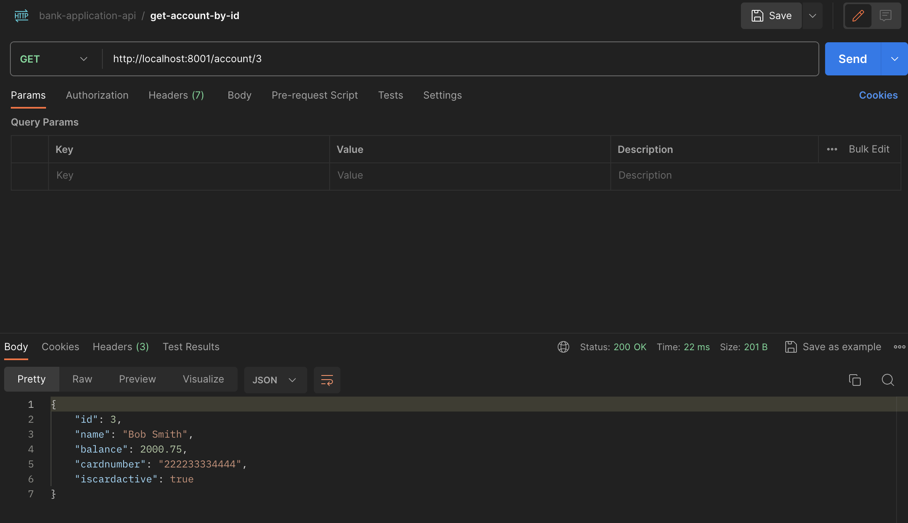
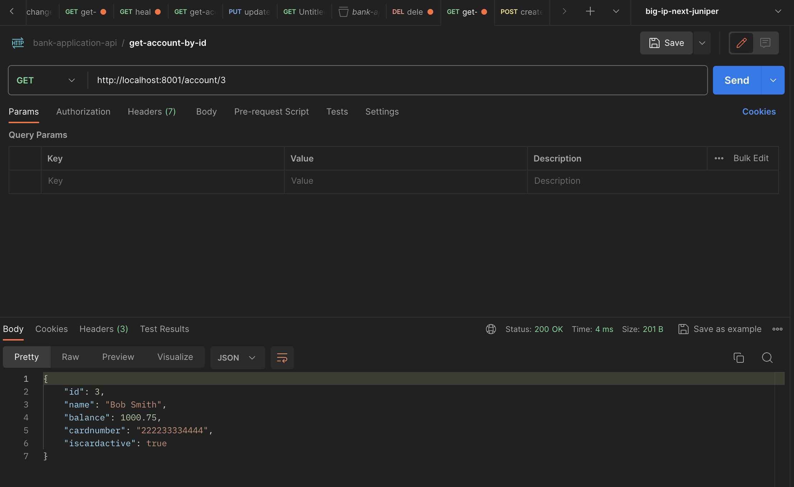
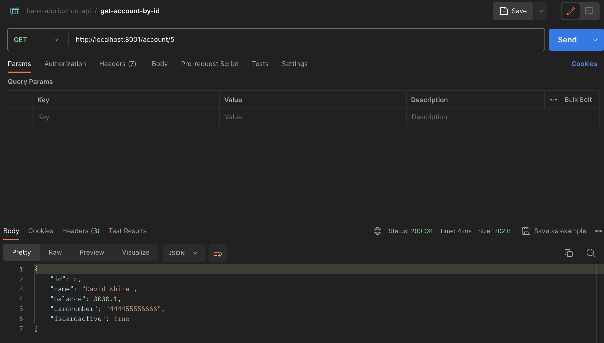
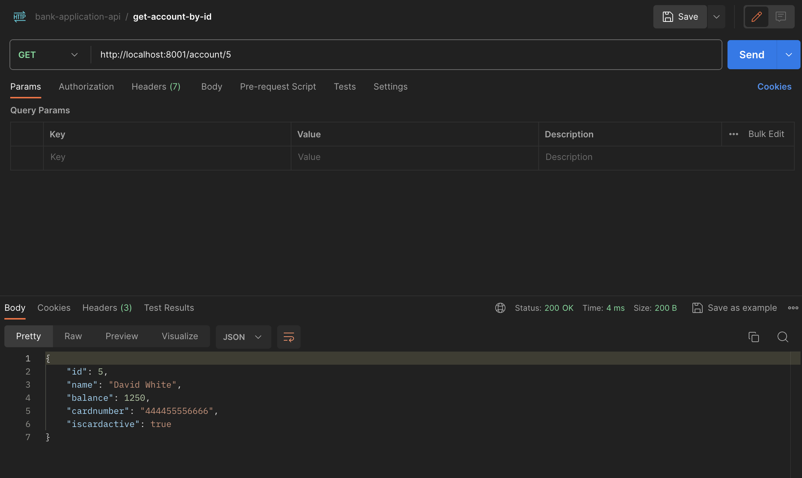
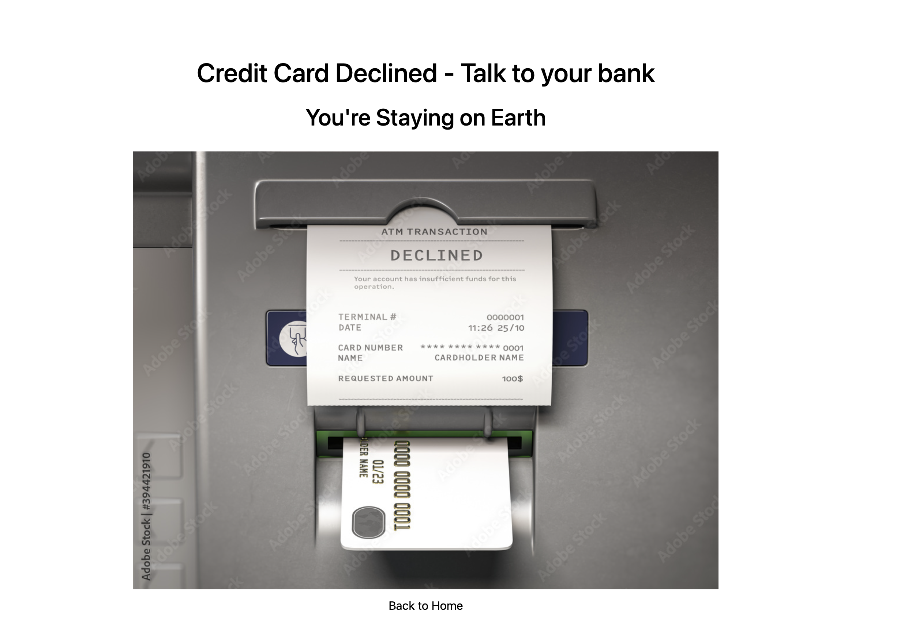

# Ticket to Mars Website

Welcome to the Ticket to Mars website, a fictitious platform that allows users to purchase tickets for a journey to Mars. This project combines a web server for user interaction and a gRPC client that communicates with a separate gRPC server to validate ticket purchase requests.

## Getting Started

To run the Ticket to Mars website locally, follow these steps:

### Prerequisites

- [Go](https://golang.org/dl/) installed on your machine
- - **protoc** for protobuf compilation (Maybe not needed). To compile protobuf, run:
```bash
$ cd payment
$ protoc --go_out=paths=source_relative:. --go-grpc_out=paths=source_relative:. payment.proto
```

### Installation

1. Clone this repository:

   ```bash
   git clone https://github.com/gteca/ticket-to-mars-website.git
   cd ticket-to-mars-website
   ```

2. Install the Go dependencies:

   ```bash
   go mod download
   ```

### Running the Application

1. Start the gRPC server (Follow the instructions at [api-and-grpc-server-in-golang](https://github.com/gteca/api-and-grpc-server-in-golang) to run the gRPC server).

2. Start the web server:

   ```bash
   go run main.go
   ```

   The Ticket to Mars website will be accessible at [http://localhost:8080/mars](http://localhost:8000/mars).

## Features

- **User Information Form**: Users can input their name, email, ticket quantity, date, and credit card number.

- **gRPC Client Integration**: The web server acts as a gRPC client and communicates with the gRPC server to validate ticket purchase requests.

- **Ticket Validation**: Ticket purchase depends on the response from the gRPC server, which validates the user's request.

Main page

Use Postman to display user account status 

User filled data to purchase the ticket

Ticket purchased

User was charged and the current balance reflect the amount deduct from the account after the purchase

Picked second user account

Second user attemp to buy tickets which price exceed his current balance 

Payment declined (The reason is logged in the GRPC client stdout)



---
Enjoy your journey to Mars with Ticket to Mars! 🚀✨